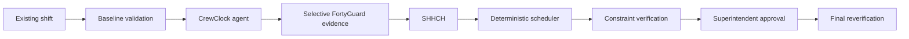

# CrewClock

## CrewClock — FortyGuard Hackathon 2026

CrewClock is a pre-shift agent for construction superintendents. It uses workface-level heat evidence to find a lower-overlap task sequence without breaking the existing plan.

**Live demo:** [crewclock.oluwatomireoluwa.chatgpt.site](https://crewclock.oluwatomireoluwa.chatgpt.site)

**Demo video:** YouTube URL pending

**Primary track:** Agentic AI

**Secondary track:** Industrial & Enterprise

## The problem

A superintendent starts with a shift that already contains crews, tasks, workfaces, fixed commitments, and deadlines. A weather alert does not answer which task can move, where it can move, or whether the new sequence still works.

## What CrewClock does

CrewClock reviews the existing shift before crews deploy. The agent selects the workfaces and time windows that need investigation. FortyGuard supplies modeled environmental evidence. Deterministic code calculates SHHCH, tests feasible schedule alternatives, checks hard constraints, and verifies the approved result. The superintendent makes the final decision.

If required evidence is missing, stale, or unusable, CrewClock keeps the current shift. Unknown evidence never becomes zero.

## Proven result

The authoritative run used San Diego, California, on August 28, 2026, from 12:00 to 17:00 local time.

| Measure | Result |
| --- | ---: |
| SHHCH | **18 → 9** |
| Reduction | **50%** |
| Flexible tasks moved | **3** |
| Fixed tasks moved | **0** |
| Constraints | **6/6 → 6/6** |
| Human approval | **PASS** |
| Final reverification | **PASS** |

The run used fresh live FortyGuard evidence. The evidence path is in [`evidence/san-diego-final-positive`](evidence/san-diego-final-positive).

SHHCH is a schedule-placement metric. It is not a medical exposure score, safety certification, heat-dose measure, or compliance statement.

## Why FortyGuard matters

FortyGuard is load-bearing environmental intelligence for the decision. CrewClock sends selected workface polygons and schedule windows to the `POST /v1/heatmap` path. It reads asynchronous activity results from `GET /v1/status/{activity_id}` and uses the `exceedance` analytic with a 32 °C project trigger.

CrewClock checks reachable destination windows before it credits a task move. A destination must have decision-grade evidence. Missing evidence is not a safe value and is never treated as zero.

## How it works



## Decision boundaries

- **AI agent:** chooses the investigation path, workfaces, and time windows. It explains the recommendation.
- **FortyGuard:** provides modeled environmental evidence.
- **Deterministic code:** owns arithmetic, schedule feasibility, and hard constraints.
- **Superintendent:** approves, rejects, or keeps the current shift.

## Run locally

```bash
npm install
npm run build
python -m pytest -q
npm run test:ui
npm run typecheck
npm run lint
```

To run the local product, start the API and frontend in separate terminals:

```bash
npm run dev:api
npm run dev
```

Create `.env` from `.env.example` for provider-backed local flows. Keep all values local and server-side.

## Environment variables

The repository uses these variable names. Add values only to a local, ignored `.env` file or the deployment secret store.

`FORTYGUARD_API_KEY`
`FORTYGUARD_BASE_URL`
`GROQ_API_KEY`
`GROQ_MODEL`
`TOKENROUTER_API_KEY`
`TOKENROUTER_BASE_URL`
`TOKENROUTER_MODEL`
`LLM_PRIMARY_PROVIDER`
`LLM_SECONDARY_PROVIDER`
`LLM_INTERACTIVE_TIMEOUT_MS`
`LLM_MAX_INTERACTIVE_TOTAL_MS`
`LLM_MAX_INTERACTIVE_MODEL_TURNS`

## Tests and gates

The latest local verification passed: 152 Python tests, 49 Vitest tests, typecheck, lint, and production build. The public demo and backend replay path were also verified for the accepted flow.

## Repository map

- `src/` — React interface, deterministic scheduling engine, SHHCH, agent boundary, and Python runtime.
- `scripts/` — runtime generation, site packaging, and local API entry points.
- `tests/` — Python integration and policy tests.
- `docs/` — the five judge-facing technical and submission documents.
- `evidence/san-diego-final-positive/` — authoritative run summary and focused screenshots.

## Team

btn operations

Oluwatomi Babatunde

Oluwabamise Akinmurele
