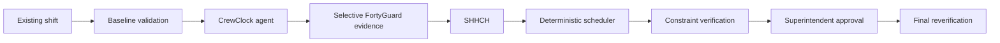

# CrewClock

## CrewClock — FortyGuard Hackathon 2026

CrewClock is a pre-shift operations agent for construction superintendents. It uses workface-level heat evidence to find a lower-overlap task sequence without breaking the existing plan.

**Primary track:** Industrial & Enterprise  
**Secondary track:** Agentic AI

## Submission deliverables

| Deliverable | Direct link |
| --- | --- |
| Working demo / prototype | [Open CrewClock](https://crewclock.oluwatomireoluwa.chatgpt.site) |
| Code repository | [GitHub — `mightbeire/crewclock-fortyguard`](https://github.com/mightbeire/crewclock-fortyguard) |
| Short video presentation | [Watch the 2:48 CrewClock demo](https://youtu.be/gbTTAxec-f4) |
| Written project summary | [`docs/SUBMISSION.md`](docs/SUBMISSION.md) |
| FortyGuard API usage documentation | [`docs/FORTYGUARD_INTEGRATION.md`](docs/FORTYGUARD_INTEGRATION.md) |
| Demo and measured results | [`docs/DEMO_AND_RESULTS.md`](docs/DEMO_AND_RESULTS.md) |
| FortyGuard availability research | [`docs/FORTYGUARD_AVAILABILITY_RESEARCH.md`](docs/FORTYGUARD_AVAILABILITY_RESEARCH.md) |
| Primary San Diego evidence | [`evidence/san-diego-final-positive/`](evidence/san-diego-final-positive) |
| Independent Tucson evidence | [`evidence/fresh-live-positive-2026-08-29/`](evidence/fresh-live-positive-2026-08-29) |

## The problem

A superintendent starts with a shift that already contains crews, tasks, workfaces, fixed commitments, and deadlines. A weather alert does not answer which task can move, where it can move, or whether the new sequence still works.

## What CrewClock does

CrewClock reviews the existing shift before crews deploy. The agent selects the workfaces and time windows that need investigation. FortyGuard supplies modeled environmental evidence. Deterministic code calculates SHHCH, tests feasible schedule alternatives, checks hard constraints, and verifies the approved result. The superintendent makes the final decision.

If required evidence is missing, stale, or unusable, CrewClock keeps the current shift. Unknown evidence never becomes zero.

## Proven result

The authoritative run used San Diego, California, on August 28, 2026, from 12:00 to 17:00 local time.

| Measure | Result |
| --- | ---: |
| SHHCH | **18 → 9** |
| Reduction | **50%** |
| Flexible tasks moved | **3** |
| Fixed tasks moved | **0** |
| Constraints | **6/6 → 6/6** |
| Human approval | **PASS** |
| Final reverification | **PASS** |

The run used fresh live FortyGuard evidence. The evidence path is in [`evidence/san-diego-final-positive`](evidence/san-diego-final-positive).

### Fresh live validation (August 29, 2026)

A fresh live validation was conducted in Tucson, Arizona on August 29, 2026 (06:00–16:00 local time) across a locked 7-task, 3-crew, 4-workface construction fixture.

| Measure | Result |
| --- | ---: |
| Location | **Tucson, Arizona** |
| Baseline hard constraints | **6/6 passed** |
| Fresh live FortyGuard calls | **YES (20 activities, 0 cache reuses)** |
| Evidence classification | **LIVE_ACQUIRED_SEGMENTED** |
| SHHCH | **60h → 24h** |
| Reduction | **36h (60.0%)** |
| Flexible tasks moved | **3** |
| Fixed tasks moved | **0** |
| Final hard constraints | **6/6 passed** |
| Superintendent approval | **APPROVED** |
| Final reverification | **PASS** |

The fresh evidence artifacts and browser screenshots are in [`evidence/fresh-live-positive-2026-08-29`](evidence/fresh-live-positive-2026-08-29).

SHHCH is a schedule-placement metric. It is not a medical exposure score, safety certification, heat-dose measure, or compliance statement.

## Why FortyGuard matters

FortyGuard is load-bearing environmental intelligence for the decision. CrewClock sends selected workface polygons and schedule windows to the `POST /v1/heatmap` path. It reads asynchronous activity results from `GET /v1/status/{activity_id}` and uses the `exceedance` analytic with a 32 °C project trigger.

CrewClock checks reachable destination windows before it credits a task move. A destination must have decision-grade evidence. Missing evidence is not a safe value and is never treated as zero.

## Engineering research: FortyGuard availability

During integration, we observed that equivalent valid heatmap requests did not always return the same kind of evidence at different U.S. coordinates. We ran a controlled availability study instead of treating every empty response as a CrewClock failure.

The experiment made **84 FortyGuard requests across 13 U.S. coordinates**. It paired TCM and `exceedance` requests, historical and future windows, consistent workface-sized AOIs, the same polling policy, and limited repeat tests.

| Result class | Requests |
| --- | ---: |
| Decision-grade, nonzero | **49** |
| Decision-grade, explicit zero | **3** |
| Completed with empty evidence | **32** |
| Provider failures | **0** |
| Timeouts | **0** |
| Invalid requests | **0** |
| Client errors | **0** |

All activities completed in about **20.6–45.4 seconds**, and repeat results were deterministic. Under these controlled conditions, the observed difference tracked **request location**. We did not find evidence that the difference was caused by future versus historical data, TCM versus `exceedance`, asynchronous delay, or CrewClock's client.

This is **not** a permanent city-support map or a claimed FortyGuard coverage boundary. It is an observed integration result from this test set. CrewClock therefore treats an explicit zero as valid evidence, but it never treats completed-empty or incomplete evidence as zero. If decision-grade evidence is unavailable, the current shift is preserved.

For evaluator testing, the strongest validated positive locations are **San Diego, California**, and **Tucson, Arizona**. **Palm Springs, California**, also returned usable FortyGuard evidence during testing.

Read the engineering report: [`docs/FORTYGUARD_AVAILABILITY_RESEARCH.md`](docs/FORTYGUARD_AVAILABILITY_RESEARCH.md).

## How it works



## Decision boundaries

- **AI agent:** chooses the investigation path, workfaces, and time windows. It explains the recommendation.
- **FortyGuard:** provides modeled environmental evidence.
- **Deterministic code:** owns arithmetic, schedule feasibility, and hard constraints.
- **Superintendent:** approves, rejects, or keeps the current shift.

## Run locally

```bash
npm install
npm run build
python -m pytest -q
npm run test:ui
npm run typecheck
npm run lint
```

To run the local product, start the API and frontend in separate terminals:

```bash
npm run dev:api
npm run dev
```

Create `.env` from `.env.example` for provider-backed local flows. Keep all values local and server-side.

## Environment variables

The repository uses these variable names. Add values only to a local, ignored `.env` file or the deployment secret store.

`FORTYGUARD_API_KEY`  
`FORTYGUARD_BASE_URL`  
`GROQ_API_KEY`  
`GROQ_MODEL`  
`TOKENROUTER_API_KEY`  
`TOKENROUTER_BASE_URL`  
`TOKENROUTER_MODEL`  
`LLM_PRIMARY_PROVIDER`  
`LLM_SECONDARY_PROVIDER`  
`LLM_INTERACTIVE_TIMEOUT_MS`  
`LLM_MAX_INTERACTIVE_TOTAL_MS`  
`LLM_MAX_INTERACTIVE_MODEL_TURNS`

## Tests and gates

The latest local verification passed: 152 Python tests, 49 Vitest tests, typecheck, lint, and production build. The public demo and backend replay path were also verified for the accepted flow.

## Repository map

- `src/` — React interface, deterministic scheduling engine, SHHCH, agent boundary, and Python runtime.
- `scripts/` — runtime generation, site packaging, and local API entry points.
- `tests/` — Python integration and policy tests.
- `docs/` — judge-facing technical, submission, and engineering-research documents.
- `docs/FORTYGUARD_INTEGRATION.md` — definitive documentation of FortyGuard API usage in CrewClock.
- `docs/FORTYGUARD_AVAILABILITY_RESEARCH.md` — controlled 84-request availability study across 13 U.S. coordinates.
- `evidence/san-diego-final-positive/` — authoritative run summary and focused screenshots.
- `evidence/fresh-live-positive-2026-08-29/` — fresh-live validation run summary and browser evidence screenshots.

## Team

btn operations

Oluwatomi Babatunde

Oluwabamise Akinmurele
