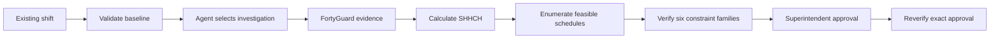

# Architecture

CrewClock is a React/Vite application with a thin Python runtime and a Cloudflare Worker deployment entry point. The existing shift remains the source of truth until a superintendent approves a verified recommendation.

## Decision flow

## Runtime boundary

The browser submits a review session to the production API. The backend owns provider credentials, request construction, evidence identity, and bounded polling. The agent can select an investigation path, workfaces, and time windows. It cannot set schedule times or approve a plan.

The deterministic engine owns baseline validation, SHHCH arithmetic, destination-window coverage, schedule generation, constraint checks, and final verification. Approval is explicit and local to the demonstration. CrewClock does not write to a project-management or dispatch system.

## Code map

| Area | Location | Responsibility |
| --- | --- | --- |
| React interface | `src/App.tsx`, `src/styles.css` | Review flow, evidence view, comparison, approval |
| Deterministic engine | `src/demo/` | Investigation selection, SHHCH, scheduling, verification, replay fixtures |
| Python runtime | `src/fortyguard_agent/` | Agent boundary, providers, evidence, API, guardrails |
| Site worker | `scripts/site_worker_entry.ts` | API routes, static assets, production boundary |
| Build | `scripts/build_*.mjs` | Runtime generation and Worker-compatible site output |
| Tests | `tests/`, `src/demo/*.test.ts` | Python and Vitest regression coverage |

## Scheduler ownership

The scheduler tests feasible alternatives in 30-minute slots. It preserves crew availability, qualifications, dependencies, deadlines, fixed commitments, and employer controls. It selects the feasible plan with the lowest modeled SHHCH, then the smallest timing change.

The LLM never performs schedule arithmetic. Required evidence resolves to `PASS`, `FAIL`, or `UNKNOWN`. Unknown required evidence blocks a thermal recommendation.
