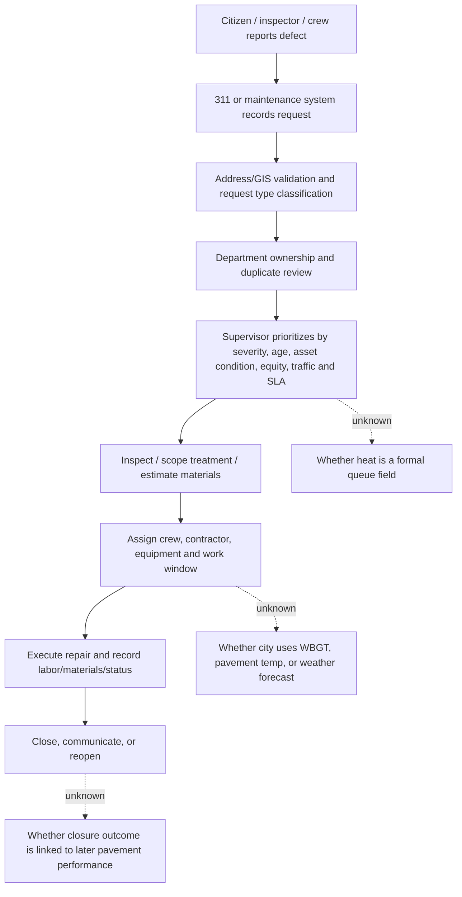
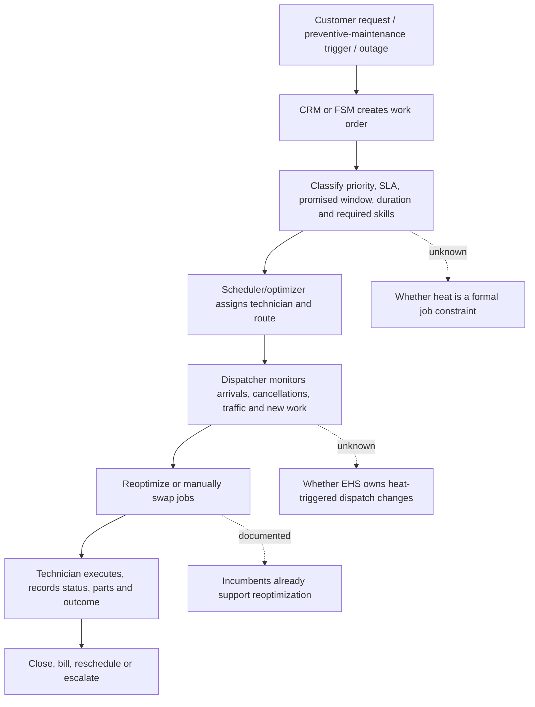
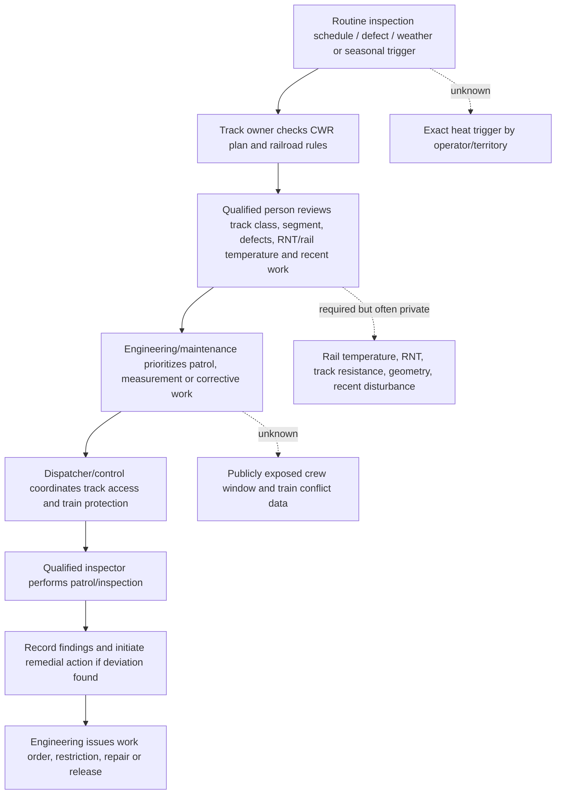

# Workflow research

Date: 2026-08-19. This document reconstructs the pre-product workflow from public manuals, government data schemas, operator procedures and incumbent software documentation. Where no public source exposes a step, it is labelled `UNKNOWN — requires customer discovery`; it is not filled with a convenient assumption.

## 1. Surface-conditioned Road Repair Queue

### Actual role and authority

The most defensible user title is **Street Maintenance Superintendent**, **Public Works Operations Supervisor**, or **Street/Highway Maintenance Scheduler**. The organization is a city public works, transportation, or streets department. The role typically reports through a public works director or transportation operations chain and coordinates inspectors, dispatchers, crew leads, contractors and 311/service-request staff. A 311 request creator is not the buyer or scheduler.

Public evidence verifies the existence of service requests and work-order systems, not the exact title hierarchy in every city. Cityworks documents work orders, service requests, inspections and mobile execution; MyLA311 exposes request owner, assignment, status, dates and coordinates; FHWA documents pavement-management prioritization. User existence: **VERIFIED**. Exact heat-specific decision authority: **PARTIAL**.

### Pre-product workflow

Evidence for A–D and H–I: MyLA311 and Cityworks schemas/documentation. Evidence for prioritization logic: FHWA pavement-management guidance and local public-works examples. The exact inspection-to-scope handoff, SLA categories, crew calendars, contractor rules and heat practice are city-specific and must remain unknown until a city system is selected.

### Work-order fields that are credible

`request_id`, `created_at`, `updated_at`, `closed_at`, `request_type`, `description`, `status`, `owner`, `assigned_group`, `latitude`, `longitude`, `address_verified`, `service_date`, `asset/road segment`, `severity`, `traffic/criticality`, `treatment type`, `crew`, `estimated duration`, `materials`, `SLA/due date`.

The last eight fields are not all present in MyLA311. They are the minimum integration contract to request from a pilot city; the demo must distinguish source fields from schema-faithful fixture fields.

### What heat actually changes

- **Human exposure: VERIFIED.** Paving, patching, milling, traffic control and inspection are outdoor physical work. OSHA identifies workload, sunlight, humidity, clothing and heat sources as relevant. A city should use site WBGT/workload/PPE policy for safety decisions.
- **Material effects: SUPPORTED BUT CONTEXT-DEPENDENT.** FHWA documents mat temperature and compaction windows, hot-mix placement rules, and temperature-dependent pavement behavior. Ambient heat can influence cooling and work conditions, but the correct decision depends on mix, lift, surface, delivery, equipment and local specification. Heat is not a universal reason to reorder a 311 queue.
- **Operational consequence: SUPPORTED BUT CONTEXT-DEPENDENT.** Early/late work windows, crew availability, traffic controls and material delivery can change. The evidence supports a work-window verifier more strongly than a citywide backlog reorder.

### Workflow conclusion

The existing concept starts with the wrong primary intervention. Public-works supervisors do prioritize work orders, but the strongest heat-specific action is likely **choose or validate a safe/technically feasible execution window for an already-approved road job**, not “decide that heat makes this request more urgent.”

## 2. Thermal Sequence Planner

### Actual role and authority

The real users are **Field Service Dispatch Manager**, **Dispatch Supervisor**, **Resource Scheduler**, **Service Operations Coordinator**, or **Workforce Planning Manager**. The organization is a utility, telecom, HVAC, facilities, appliance, elevator, industrial-service or other field-service operation. Dispatchers work under a service operations manager; EHS/safety may own heat policy; customer service owns appointment commitments; IT/security and the FSM administrator control integrations. User existence: **VERIFIED**. A heat-aware sequence decision owner: **PARTIAL** because it sits across dispatch and EHS.

### Pre-product workflow

Evidence for A–H: ServiceNow, Salesforce, Microsoft, IBM and OR-Tools documentation. Existing platforms already support time windows, skills, travel, priorities, dynamic scheduling and in-day reoptimization. The current project does not have a real technician/job dataset, travel matrix, skills roster, customer promises or a named pilot system.

### Heat relationships

- **Human exposure: VERIFIED.** Outdoor field work can require timing and work/rest controls. OSHA/NIOSH require workload, PPE, acclimatization and site conditions to be considered; a route’s ambient temperature is not enough to determine safe exposure.
- **Material/equipment: SUPPORTED BUT CONTEXT-DEPENDENT.** Some tasks and equipment have temperature limits, but the specific service category and manufacturer rules matter. The current finalist has no chosen trade or equipment class.
- **Operational consequence: SUPPORTED BUT CONTEXT-DEPENDENT.** Jobs can move when appointment windows, skills, travel and safety policy permit. The feasible sequence is a standard VRPTW/constraint problem; heat can be an added objective or soft constraint.

### Workflow conclusion

This is a real workflow, but it is a feature request against mature FSM optimizers. The meaningful product must be an evidence-aware exception layer that consumes the customer’s existing schedule, obtains site-specific heat evidence only for affected jobs, proposes constrained alternatives, and verifies policy/appointment compliance. A new route optimizer or chat scheduler is not credible differentiation.

## 3. RailHeat Patrol Sequencer

### Actual role and authority

The real roles are **Maintenance-of-Way Planner**, **Track Supervisor**, **Roadmaster**, **Chief Engineer–Track**, **Railroad Engineering Manager**, **Track Inspector**, and, for train movement conflicts, a **Train Dispatcher/Operations Control** role. The organization is a freight railroad, passenger railroad, commuter agency, transit operator or infrastructure owner. The track supervisor/qualified inspector and railroad engineering chain retain safety authority; a software planner cannot authorize track occupancy, slow orders, or remedial movements.

User existence: **VERIFIED**. A public, cross-operator “patrol sequencer” with the needed operator inputs: **NO**. The role exists, but the proposed product’s exact decision boundary is not verified.

### Pre-product workflow

Evidence for mandatory authority and inspection: 49 CFR 213.118 and 213.233. Evidence for rail-specific thermal state: Amtrak CWR plan, FRA RNT and buckling materials. Evidence for public data and automated inspection: FRA ATIP, FRA Safety Data and FRA GIS.

### Heat relationships

- **Human exposure: SUPPORTED BUT CONTEXT-DEPENDENT.** Track workers are outdoor workers and may face heat, but the proposed rail value proposition is asset/operations safety, not primarily worker heat.
- **Material/asset effects: VERIFIED, but the current input is inadequate.** CWR can buckle under thermal compression. The relevant variables include rail temperature relative to neutral temperature, track restraint/geometry, maintenance disturbance and operator procedure. Ambient air temperature is a screening trigger at best.
- **Operational consequence: VERIFIED.** Inspection schedules, slow orders, remedial action and train movements are regulated/controlled. A wrong recommendation can create serious safety and service consequences.

### Workflow conclusion

The current concept overclaims what FortyGuard can establish. Satellite segmentation can validate that a pixel is not obviously unrelated to rail, but it cannot provide track inventory, rail temperature, RNT, CWR plan compliance or authority to schedule a patrol. The defensible mutation is a **Rail Summer Preparedness Evidence Agent** that checks a railroad-provided CWR/summer-preparedness plan, highlights missing evidence and drafts a human-reviewed checklist. It must not claim to predict buckling or autonomously sequence safety patrols from ambient heat.

## Cross-workflow evidence gaps

| Gap | Road | Thermal | Rail |
|---|---|---|---|
| Real system-of-record export | Public schema available; live city join unknown | No real FSM export in repository | Operator export generally private |
| Decision owner | Public works supervisor likely; exact city authority unknown | Dispatch + EHS boundary unknown | Qualified track/engineering authority verified |
| Heat metric accepted by safety policy | Site WBGT/material temp required | Site WBGT/workload/PPE required | Rail temperature/RNT/operator rules required |
| Public schedule/constraint data | Partial | Weak; benchmark data is synthetic | Weak for patrol/crew/train conflicts |
| Human approval | Required for work-plan changes | Required for service/SLA/safety changes | Mandatory for safety/track movement decisions |
| Most defensible intervention | Window verification | Exception/replan layer | Evidence/checklist audit |

## Adoption workflow implication

The agent should sit beside the system of record and write a draft recommendation with source links, constraints, uncertainty and an explicit approval state. It should never silently mutate a work order, dispatch a crew, issue a rail restriction or declare a worker safe.
